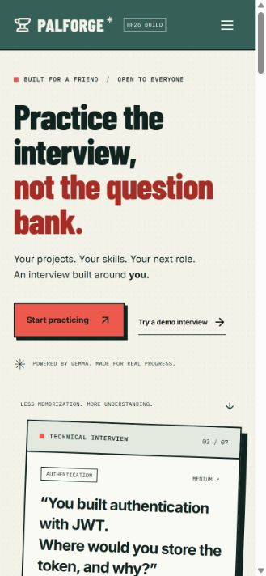
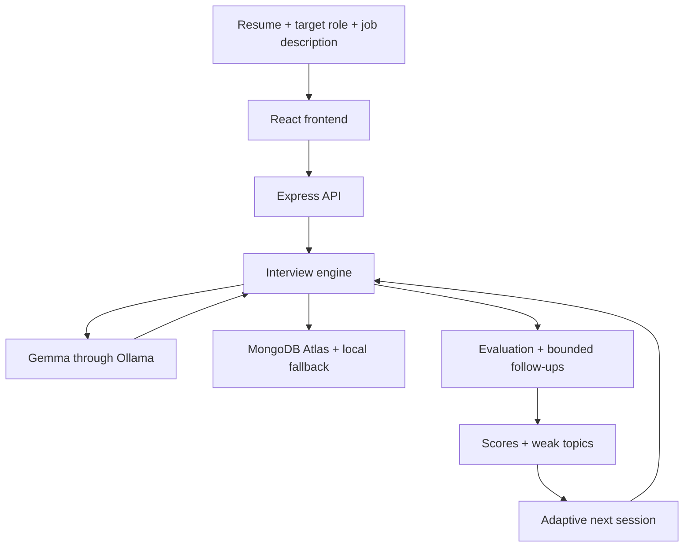

# PalForge

**Open-source AI interview practice, forged for a friend.**



One friend. One target role. One interview built around what they actually know.

PalForge turns a candidate’s resume and target job into a technical interview, with answer evaluation, bounded adaptive follow-ups, a weakness profile, and a next practice session. Its paper, forest, and coral interface takes its cues from developer festivals and printed posters.

## The problem

A friend preparing for software engineering placements needed to explain the projects and decisions on his own resume. Generic question banks covered plenty of material, but missed the context: what he built, why he chose his stack, and what the next company expected.

## What I built

- A resume-grounded interview with 5, 7, or 10 questions.
- Warm-up, Standard, and Pressure styles.
- Technical answer evaluation with strengths, missing points, and specific feedback.
- Up to two deeper follow-ups per main question in Pressure Mode.
- Results calculated from actual answers, with topic scores and targeted exercises.
- Adaptive next sessions that prioritize weak topics.
- A no-setup demo, saved draft answers, resumable sessions, and lightweight browser session history.

## Why open-weight AI?

Gemma through Ollama allows local inference, model flexibility, customized interviewer behavior, and no proprietary per-question API charges. Local inference does not send resume context to a hosted model provider. Google AI Studio is also supported for hosted deployments: in that mode, resume context and answers are sent to Google's Gemini API. Remote Ollama and MongoDB Atlas also receive the corresponding data when configured. Hosted inference has provider quotas and terms; local inference consumes hardware resources.

The demo is explicitly labeled and uses authored questions plus a simple keyword rubric. Its scores illustrate the interaction; they do **not** verify correctness. Real sessions call Gemma; there is no silent fallback to pretend AI output.

## How PalForge works

Resume → job description → Gemma → questions → evaluation → weakness profile → adaptive next session.

## Pressure Mode

Answers scoring below 8/10, or flagged by the evaluator as incomplete, trigger a deeper question. Conversation context informs the follow-up. The engine caps questioning at two follow-ups per main question. Warm-up and Standard sessions provide feedback and move on.

Scores average each main answer with its evaluated follow-ups and then average across questions. Topic scores average questions in that topic. Skipped main questions count as zero; skipped follow-ups do not erase an evaluated main answer. Topics below 70/100 are marked for practice. Scores are practice signals, not hiring decisions.

## Tech stack

React + Vite · React Router · Lucide · CSS variables · Node.js + Express · Zod · MongoDB/Mongoose · Gemma + Ollama. The Node server can serve the built frontend on Render or another Node host.

## Running locally

Requires Node.js 22 or newer and npm.

```sh
npm install
cp .env.example .env
npm run dev
```

PowerShell: use `Copy-Item .env.example .env` instead of `cp` if preferred, and `npm.cmd` if your execution policy prevents npm scripts from launching.

Open **http://127.0.0.1:5173**. The API runs on port 3001. Start with **Try a demo interview**; it works without Ollama or MongoDB.

For real AI interviews, install [Ollama](https://ollama.com), then:

```sh
ollama pull gemma3:4b
ollama serve
```

If the Ollama desktop app is already running, it already serves the API; do not start a second instance. Set `GEMMA_PROVIDER=ollama`, `OLLAMA_URL`, and `GEMMA_MODEL` in `.env` if needed. Allow up to two minutes per model call; latency depends on your hardware. The server uses Ollama’s [JSON output format](https://github.com/ollama/ollama/blob/main/docs/api.md).

For MongoDB Atlas, set `MONGODB_URI` to your connection string and configure your Atlas network access. Never commit `.env`. With no URI, sessions persist under the ignored `data/` directory. With an unavailable MongoDB connection, the app saves locally and returns a visible warning. Every session also has a local file backup. Browser drafts and history live on the device; deleting browser data removes those drafts and session shortcuts.

```sh
npm run build
npm start
```

Production UI and API are available together at **http://127.0.0.1:3001**.

### Validation

```sh
npm test
```

Unit tests cover the follow-up cap, style behavior, state sequencing, skips, JSON extraction, and adaptive ordering. To include the full API round-trip test, start the server first:

```powershell
$env:TEST_API_URL = 'http://127.0.0.1:3001'
npm.cmd test
```

## Architecture



`server/services/gemmaService.js` owns question generation, answer evaluation, follow-up generation, and final analysis. It selects Google AI Studio or Ollama using server-side configuration. Candidate text is treated as untrusted context. Model JSON is extracted, validated, and retried once for malformed responses. `interviewEngine.js` controls transitions; overlapping writes to the same session are rejected. The browser never calls the model directly or receives the API key.

### API

| Method | Endpoint | Purpose |
|---|---|---|
| POST | `/api/interviews` | Create from candidateName, targetRole, resume, jobDescription, difficulty, questionCount |
| POST | `/api/interviews/demo` | Create the preconfigured demo |
| GET | `/api/interviews/:id` | Load or resume a session |
| POST | `/api/interviews/:id/answers` | Submit questionId, answer, optional followUp or skip |
| GET | `/api/interviews/:id/results` | Calculate and cache a completed session’s results |
| POST | `/api/interviews/:id/next-session` | Create a weak-topic-weighted interview |
| GET | `/api/health` | Check server availability and configuration |

Resume text is mandatory. PDF extraction and microphone capture are intentionally outside this MVP.

## Deployment

For Render, use `npm ci && npm run build` as the build command and `npm start` as the start command. Configure the following in **Environment**:

| Variable | Value |
|---|---|
| `GEMMA_PROVIDER` | `google` |
| `GEMMA_MODEL` | `gemma-4-26b-a4b-it`, or another Gemma model available in your AI Studio account |
| `GEMMA_API_KEY` | Your Google AI Studio API key (server secret) |
| `HOST` | `0.0.0.0` |
| `MONGODB_URI` | Keep your existing Atlas connection string |

Use Google's exact API model ID, **not** an Ollama tag such as `gemma3:4b`. The Google adapter also accepts `gemini` as a provider alias and `GOOGLE_API_KEY` or `GEMINI_API_KEY` as key aliases. Prefer explicitly setting `GEMMA_PROVIDER`; without it, a Google-style key selects Google and no key selects Ollama. See [Google's Gemma API guide](https://ai.google.dev/gemma/docs/core/gemma_on_gemini_api).

After pushing these changes to your repository, deploy the latest commit on Render and save the environment settings with a redeploy. Open `/api/health`: `ai.provider` should be `google` and `ai.configured` should be `true`. This checks configuration only; it does not prove the key has model access or remaining quota. Run `npm run ai:check` in a server shell to verify the provider recognizes the configured model without sending a resume. Then try a real interview.

You do not need Ollama installed on Render when using Google. If you prefer Ollama, set `GEMMA_PROVIDER=ollama`, a reachable `OLLAMA_URL`, an Ollama model tag, and optional `OLLAMA_API_KEY` for a protected server. `127.0.0.1` on Render refers to the Render container, not your laptop.

Local file fallback on an ephemeral host does not survive redeploys; use MongoDB and a persistent disk for durable backups.

There is no authentication by design. Session URLs grant access to resume text and answers. Keep real-data deployments private or behind access control. A public judge demo should contain only the fictional profile and should not invite real personal data. Nothing is deployed by this repository alone.

## Hacktoberfest

Built for the Hacktoberfest 2026 Weekend Challenge, **Build for a Friend**. PalForge is independently branded; no affiliation or sponsorship is implied. See [the submission draft](docs/DEV_SUBMISSION.md) for a starting point. Add your own repository, deployment, and real friend’s story before publishing.

## Open source

Application code is licensed under [MIT](LICENSE). Gemma model weights retain their own upstream license and terms. Contributions that improve interview quality, accessibility, or local inference are welcome. Please keep the scope focused: no recruiter portal, payments, or job marketplace.
